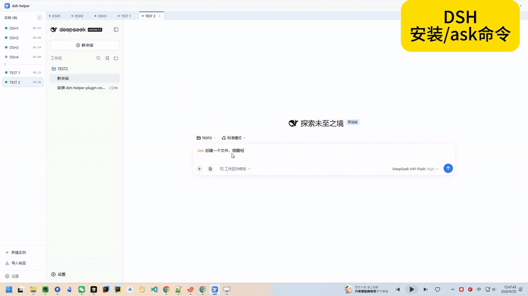

# dsh-helper-plugin-command-ask

[English](README.md) | 中文


给 [DeepSeek Harness](https://github.com/deepseek-ai/deepseek-harness)（`dsh`）用的 **`/ask` 模式**插件：仿照官方 `/plan` 模式、对齐 Cursor 的 **Ask** 模式——对**这一轮提问**给出只读回答。

**为什么需要它**：平时 `dsh` 会话会边聊边改文件。但有时你只想要一个答案——*这个配置在哪、为什么重试三次、改这里会牵连什么*——而不希望 Agent 动任何东西。ask 轮里它只能看、不能改，而且工具守卫会**真的拦下**改动，即使模型忘了。

**用起来是什么样**：`/ask 问题` 只让这一轮变成只读问答——只引用实读内容、不改动任何东西——**模式在该轮结束时自动释放**，所以之后不带 `/ask` 的消息就是普通干活：先问，再说一句"执行"即可。`/ask off` 只是提前取消。

```text
/ask 为什么重试预算是 3？      这一轮只读回答，然后恢复正常
/ask                          为下一轮预置 ask 模式
/ask off                      提前取消（从来不必要）
```

**一行安装：**

```sh
dsh plugin --profile web add link:/absolute/path/to/dsh-helper-plugin-command-ask
dsh plugin --profile web add github:x102201/dsh-helper-plugin-command-ask
```

---

<a href="docs/assets/ask-mode-demo.mp4"></a>

*在 [**dsh-helper**](https://102201.com/products/dsh-helper/zh/) 工作台实录（1.6 倍速）——左侧是实例列表，四个 dsh 环境并排运行，其中一个装着本插件。`/ask 问题` 拒绝写入并说明原因，随后一条普通消息"执行"就真的创建了文件。→ [更清晰的 MP4（0.8 MB）](docs/assets/ask-mode-demo.mp4)*

## 它做了什么

| 组成 | 行为 |
|---|---|
| `/ask` 命令 | 预置 ask 模式，可带后缀问题（支持图片/文件附件）。`scope: turn`（默认）只覆盖一轮；`scope: session` 是 `/plan` 式常驻模式，直到 `/ask off`。 |
| 轮次边界 | 逐轮模式由 harness 自己的 `turn/end` 事件释放，因此下一次请求组装时就已经没有它了——不需要 `/ask off`。 |
| `ask:policy` 提示词分段 | 模式生效时在每次请求都渲染部署方配置的引导文本；未生效时不贡献任何文本。 |
| 持久状态 | `ask` 投影单元从会话日志里折叠 `/ask` 的 `command/run`/`command/done` 记录以及 `turn/end`。插件**不写任何自有事件类型**，并且每次切换都用 `ctx.sessions.flush()` 立刻落盘，所以重启后模式仍在。 |
| 只读守卫 | 默认开启：用 `ctx.tools.guard()` 注册单调守卫，在 ask 模式生效时拒绝被列入的改动类工具，并告知模型改为「基于可查看的内容回答」。 |
| 与 plan 模式接力 | 仅在 `scope: session` 时：常驻 ask 模式与 plan 模式互斥，进入即退出对方。 |
| 编程接口 | 提供 `ctx.askMode`：`get(agent)`、`set(agent, active)`（走真实命令）、`isActive(session)`。 |

每一轮 ask 都是自包含的：引导文本只出现在它管辖的那几次请求里，而日志把每次开关记录成一条普通的 `/ask` 命令记录。

> ### 从 0.1.x 升级
>
> 0.1.x 把模式持久化成了它自己的会话事件类型 `ask/mode`。仓库外插件**不能**扩充 harness 的事件词汇表：`Session.append()` 无法设置信封上的 `ignorable` 标记，于是持久化读取路径会拒绝含该事件的日志（*"unknown to this harness and not marked ignorable; refusing to interpret the log"*），**所有跑过 `/ask` 的会话都无法再加载**。0.2.0 不再写这种事件，并用 [`scripts/repair-ask-mode-logs.mjs`](scripts/repair-ask-mode-logs.mjs) 就地给遗留记录补上 ignorable 标记（不能直接删除：日志要求 seq 稠密）：
>
> ```sh
> node scripts/repair-ask-mode-logs.mjs --sessions <DSH_HOME>/sessions                # 先干跑
> node scripts/repair-ask-mode-logs.mjs --sessions <DSH_HOME>/sessions --apply --backup <dir>
> ```
>
> 投影的 `stateVersion` 升到 2，0.1.x 写下的缓存行会被丢弃并从命令记录重新折叠——不需要额外的迁移。

## 安装

两种安装方式都支持。插件是纯 ESM（无需构建、零运行时依赖），所以安装时既不需要编译，也不会被 pnpm 拦下来要求 allowlist 构建脚本。

> **前置条件**：`dsh plugin` 会把参数转发给 `pnpm`，所以 pnpm 必须在 `PATH` 上（`corepack enable pnpm` 即可提供）。缺了它会直接报 `pnpm not found on PATH` 并以 127 退出。

### 方式一：本地目录（`link:`）

```sh
dsh plugin --profile web add link:/absolute/path/to/dsh-helper-plugin-command-ask
```

- 路径请用绝对路径，或相对于你执行命令时所在的目录（CLI 会把相对的 `link:`/`file:` 规格锚定到**调用目录**，而不是 profile 目录）。
- `link:` 是符号链接，所以**改 `index.js`/`lib/*.js` 后重启 `dsh web` 即生效**，不用重装。

### 方式二：Git 仓库（`github:`）

```sh
dsh plugin --profile web add github:<owner>/<repo>
```

- 仓库根目录就应该是这个包（即放 `package.json` 和 `cordis.patch.yml` 的那一层）。
- 需要可复现时钉住版本：`github:<owner>/<repo>#<tag-or-commit>`。
- 因为没有 `prepare`/`postinstall` 脚本，pnpm 永远不会要求你 allowlist 构建。

### 背后发生了什么

`dsh plugin ... add` 会在 `$DSH_HOME/profiles/web` 里调用 `pnpm`，然后按**已安装状态**对齐 profile 清单（package.json）：本包声明了 `dsh.bundle.patch`，于是它的包名会被自动追加进 `dsh.profile.bundles`。下次启动时，该 bundle 的补丁层插入一行 host 行：

```yaml
- insert:
    - id: command-ask
      name: ./index.js      # 相对本补丁文件定位，因此任何安装布局都成立
```

重启 profile 即挂载：

```sh
dsh web            # 等价于：dsh --profile web
```

### 不安装也能直接试

[`examples/standalone.patch.yml`](examples/standalone.patch.yml) 里的 `../index.js` 是相对补丁文件定位的，所以一个裸 checkout 可以直接跑：

```sh
dsh --profile web --patch <checkout>/examples/standalone.patch.yml
```

改 `index.js`/`lib/*.js` 时这是最快的循环：不用安装，也不用改 profile。

### 验证安装

```sh
# 组合后的配置树里应该能看到 command-ask 行：
dsh --profile web --dump-config | grep -A2 command-ask
```

然后在 Web 界面输入框里输入 `/ask`：斜杠菜单会列出 **`/ask` Enter or leave ask mode (read-only Q&A)**，命令结果提示 `Ask mode on (read-only). Use /ask off to leave.`。随便问一个问题，再试着让它改代码：它应该只描述该怎么改；被守卫拦下的工具调用会返回 `ask mode is read-only`。

不想开浏览器时，可以拿 `dsh web` 打印出来的 URL 直接跑实时验证脚本：

```sh
node scripts/verify-live.mjs --url "http://127.0.0.1:PORT/?token=TOKEN" --workspace <目录>
node scripts/verify-live.mjs --url "..." --workspace <目录> --model-turns
```

它走的是和浏览器同一套 HTTP RPC（先建一个真实会话，再对它下命令），断言 `/ask` 的注册信息、命令结果、实时 `ask` 投影值、以及落盘的 `ask/mode` 事件；加 `--model-turns` 会真的跑两轮模型回合——ask 模式下要求创建文件、`/ask off` 之后再要求一次——并断言文件只在第二轮出现。

### 卸载

```sh
dsh plugin --profile web remove dsh-helper-plugin-command-ask
```

依赖被移除后，对齐逻辑会把它从 `dsh.profile.bundles` 里摘掉。已经写进会话日志的 `ask/mode` 事件会保留，只是此后无人读取。

## 配置

所有键都可选，什么都不写就用默认值。配置在加载期校验：未知键、类型错误、`section` 为空都会让启动直接失败，而不是默默忽略。

```yaml
- id: command-ask
  config:
    scope: turn          # 每次 /ask 只覆盖一轮（默认）……
    enforce: false
    blockedTools: [write, edit, pwsh]
# …… 或 scope: session 回到 /plan 式常驻模式
```

| 键 | 类型 | 默认值 | 含义 |
|---|---|---|---|
| `scope` | `turn` \| `session` | `turn` | `turn`：ask 模式只覆盖它进入的那一轮，并在该轮边界写回关闭。`session`：常驻到 `/ask off`，与 `/plan` 同构。 |
| `section` | string | 按 scope 选择的内置引导文本（见 `lib/config.js`） | 模式生效时渲染进 `ask:policy` 提示词分段的文本。 |
| `enforce` | boolean | `true` | 是否注册只读工具守卫。`false` 表示模式只作建议：仅靠引导文本。 |
| `blockedTools` | string[] | 下面列出的 22 个改动类工具 | ask 模式生效时被拒绝的工具名。**整体替换**默认列表。 |
| `allowedTools` | string[] | `[]` | 永远放行的名字，优先于 `blockedTools` 判断。 |
| `supersedePlanMode` | boolean | `turn` 下为 `false`，`session` 下为 `true` | 进入 ask 模式时把 plan 模式置为关闭。逐轮模式不动周围的模式。 |
| `narrate` | boolean | `turn` 下为 `false`，`session` 下为 `true` | 跨轮次切换模式时注入一行「用户把本会话切到了 ask 模式」的提示。逐轮模式无需提示：引导文本只出现在它管辖的那一轮，之后自然消失。 |

显式配置永远优先：`scope: turn` 配 `narrate: true` 是合法（只是略啰嗦）的组合。

覆盖配置写在哪里：profile 自己的 `cordis.patch.yml`（`$DSH_HOME/profiles/web/cordis.patch.yml`）、在 bundle 之后应用的 `--patch` 覆盖层，或直接参考 [`examples/profile-patch.yml`](examples/profile-patch.yml)。补丁会**整体替换**目标行的 `config`，而省略的键都会回落到插件默认值，所以只写你要改的部分即可。

默认拒绝列表（按意图分组）：

- **文件改动** — `write`、`edit`、`str_replace_editor`、`apply_patch`、`multi_edit`、`notebook_edit`
- **Shell**（双用途，但任何东西都能经由它写出去）— `pwsh`、`bash`、`terminal`、`shell`
- **任务跟踪与持久目标** — `todo_write`、`create_goal`、`update_goal`
- **委派与编排**（子代理不会继承本模式的承诺）— `subagent`、`subagent_fork`、`subagent_codex`、`subagent_claude_code`、`workflow`、`ralph`、`send_message`、`interrupt_agent`
- **后台任务控制** — `job_kill`

这里刻意用**黑名单**：本插件不可能穷举部署方的工具名，所以未知工具（某个 MCP 工具、别的插件注册的工具）默认仍然可调用，而不是被白名单误伤；需要拦就加进 `blockedTools`。只读类工具（`read`、`glob`、`grep`、`job_list`、`job_output`、`web_search`、`web_fetch`、`skill`、`ask_user_question`、`present` 等）不受影响。

## 工作原理

```text
/ask ──► ctx.commands.register('ask')  ──► session.append('command/run' | 'command/done')
                                                        │
                                                        ▼
                                    ctx.sessionProjections 单元 'ask'
                                    折叠 /ask 记录 + turn/end  ──►  view { active, pending }
                                                        │
                          ┌─────────────────────────────┴──────────────────────────┐
                          ▼                                                        ▼
       ctx.systemPrompt.section('ask:policy')                  ctx.tools.guard(read-only)
       （生效时注入到每次请求）                                  （生效时拒绝改动类工具）
```

- **持久状态就是命令记录本身。** `/ask` 是一条命令，命令注册表本来就会为它写 `command/run` + `command/done`；模式只是把这些记录加上 harness 自己的 `turn/end`、`request/header` 折叠出来的结果。resume / fork / compaction 通过重放日志恢复，没有需要同步的活动镜像。
- **不写自有词汇表。** 仓库外的插件无法新增会话事件类型：`Session.append()` 设置不了信封上的 `ignorable` 标记，而持久化读取路径会拒绝缺少该标记的未知类型。这里的一切都用 harness 已知的事件表达，因此会话日志对任何 harness 都可读——装不装本插件都一样。`test/plugin.test.mjs` 会断言日志里没有别的东西。
- **立刻落盘。** 投影的变更回调会调用 `ctx.sessions.flush(session)`（harness 自己的检查点入口），所以一次开关远不到一秒就写到磁盘，而不必等下一次模型请求。
- **逐轮释放。** 默认 `scope: turn` 下，模式由 harness 自己的 `turn/end` 记录结束；下一次请求组装时已经没有 `ask:policy`、也没有守卫。这正是「先问一句、再说'执行'」不需要 `/ask off` 的原因。
- **提示词稳定。** 分段只注册一次，模式关闭时返回 `''`，因此进出模式都不会改变请求的工具目录。这也是为什么可以用「守卫」而不是「藏工具」来实现强制只读。
- **切换提示（narration，仅 `scope: session`）。** 当上一次 `request/header` 描述的模式与当前生效的不一致时，一条 notice 会搭上下一个被接受步骤的消息，避免模型继续按旧姿态推理。逐轮模式不需要它：引导文本只出现在它管辖的那一轮。
- **强制点。** `ctx.tools.guard()` 是单调的，且在 `tools/pre-execute` 瀑布之后运行：任何监听器都无法翻案，而且对 `run_code` 的嵌套子调用同样生效（工具注册表会把调用方 Agent 传给子调用）。
- **与 plan 模式接力（仅 `scope: session`）。** 常驻 ask 模式严格弱于 plan 模式，因此二者互斥。插件直接写 plan 模式自己的已知事件 `plan/mode`，而不是调用它的服务：不跨隔离域，日志折叠能像其它模式切换一样恢复结果；若该 profile 没挂 plan 模式，读到的是「无此投影」，什么都不做。

### 与 `/plan` 的差异

| | `/plan` | `/ask`（默认） | `/ask`（`scope: session`） |
|---|---|---|---|
| 目的 | 先设计，批准后再执行 | 只回答这一个问题，什么都不改 | 持续只回答，什么都不改 |
| 生命周期 | 直到 `exit_plan_mode`/`/plan off` | 一轮 | 直到 `/ask off` |
| 退出方式 | `exit_plan_mode` + 用户审阅，或 `/plan off` | 轮次边界自动退出 | `/ask off` |
| 强制力 | 仅引导文本（沙箱/审批由部署方决定） | 引导文本 **加上** 黑名单工具守卫（`enforce`） | 同上 |
| 对其他模式 | 占用会话姿态 | 不动 plan 模式 | 会把 plan 模式置为关闭 |
| 浏览器 UI | 输入框的 “Plan” 徽标，读 `plan` 投影 | 无，靠命令结果文本 | 无，另有切换提示 |
| 挂载平面 | 每个 Agent preset、entry-local 隔离域 | 一行 host 行，对所有 Agent 全局生效 | 同上 |

## ask 模式**不是**的边界

- 守卫是**黑名单**：名字不在列表里的改动类工具（例如部署方自己的工具）仍然可调用。需要拦就加进 `blockedTools`。
- 真正的硬边界仍在原处：dsh 的 sandbox 模式与审批策略。ask 模式只是按工具名收窄「可以做什么」，它不改变文件系统或进程权限；要真正只读，用 `sandbox: read-only`，与本插件相互独立。
- 模型仍然可能答错。引导文本要求它给出出处、明说「未能确认」的部分——仅此而已。
- `scope: turn` 下，那一轮进行中你发的所有内容都还在这一轮里，因此仍是只读；模式是**按轮**释放，不是按条消息释放。想恢复普通干活，下一条排队即可。
- 一次开关是**异步**落盘的：`ctx.sessions.flush()` 会让它远不到一秒内写到磁盘，但如果在输入 `/ask` 之后立刻硬杀进程（不给任何 I/O 时间），这条记录可能还没落盘；普通重启（工作台的停止按钮）会走优雅退出，不做特殊处理也不会丢。真丢了也只是模式回到关闭，重新发一次 `/ask` 即可。

## 兼容性

按 **dsh `0.1.5-rc.2`** 编写。用到的服务与接缝（全部位于 host 平面）：

| 接缝 | 用途 |
|---|---|
| `ctx.commands.register()`（可选注入——没有命令面板的 profile 也能用模式本身） | `/ask` 命令；它的记录就是持久状态 |
| `ctx.systemPrompt.section()` + `getSectionOrder('PLAN_POLICY')` | `ask:policy` 分段 |
| `ctx.sessionProjections.register()` / `stateOf()` / `onChanged()` | `ask` 单元，读取 `plan`/`turnBoundary`，以及触发落盘 |
| `ctx.sessions.flush()` | 让一次开关立刻持久化 |
| `ctx.tools.guard()` | 只读拒绝 |
| `ctx.on('agent/pre-step')`、`agent.steer()` | `scope: session` 的切换提示，以及把后缀问题 steer 出去 |
| `session.append()`（只写 `plan/mode`）、`ctx.provide('askMode')` | plan 接力与编程接口 |
| `session.append()`、`ctx.provide('askMode')` | 持久状态与编程接口 |
| 投影的 `stateSchema`/`viewSchema` | 自带的极简 `parse` 兼容校验器，不依赖 `zod` |

两处刻意的「软着陆」，避免缺少某个前置时拖垮启动：`ask`/`plan` 投影缺失时按「关闭」处理；`turnBoundary` 投影缺失时按「没有打开的轮次」处理（并告警一次）。插件也**完全不 import 任何裸模块名**——这正是 `link:` 与 `github:` 两种安装行为一致的原因（Node 会按真实路径解析被链接包的 import，落在 profile 的 `node_modules` 之外）。`test/package.test.mjs` 会强制守住这条性质。

也可以把插件挂进 Agent preset 而不是 host 平面，见 [`examples/agent-preset-mount.yml`](examples/agent-preset-mount.yml)。

## 测试

```sh
npm test              # node --test
npm run test:direct   # 单进程运行（适配会拦子进程的沙箱环境）
```

82 个测试覆盖：配置校验（含 `scope` 的默认值耦合）、投影折叠与 schema、只读侧的模式读取与 plan 接力、守卫、包的可安装性性质，以及在伪 Cordis 树上的完整接线——包括「多个 ask 轮各自在自己的轮次结束」、开关立即落盘、`ctx.askMode.set` 走真实命令，以及 resume 后的模式重放。

### 验证状态

下面每一层都实跑过；带「实时」字样的几层使用一次性 `$DSH_HOME`，并在独立的 dsh 环境（`env_001ca237`）中进行，**没有碰过承载本次对话的那个 profile**。完整的命令与原始输出见 [`VERIFICATION.zh.md`](VERIFICATION.zh.md)。

1. **行为** —— 82 个单元/集成测试，跑真实的 `index.js`/`lib/*.js`，对接忠实的 Cordis 接缝替身（`test-support/harness.mjs`）。
2. **包形态** —— 静态测试守住两种安装方式都依赖的性质：运行时代码不 import 任何裸模块名（`link:` 安装无法解析裸名，Node 按真实路径解析被链接包的 import），且不携带任何需要 pnpm allowlist 的安装期脚本。
3. **两种安装命令** —— 在一次性 profile 上、dsh `0.1.5-rc.2` + pnpm 12.5.1：
   - `dsh plugin --profile web add link:<绝对路径>` → 初始化 profile、建立链接，**对齐逻辑自己**把 `dsh-helper-plugin-command-ask` 追加进 `dsh.profile.bundles`。
   - `pnpm pack` → 24 个文件，再 `dsh plugin --profile web add <tarball>` → 同样的对齐、同样的行。
   - 对本仓库 `git clone --bare`，再 `dsh plugin --profile web add git+file://<bare repo>` → 同样的对齐、同样的行。这条走的就是 pnpm 的 git fetcher，也就是 `github:` 的代码路径，只是换了本地传输。
   三种情况下 `--dump-config` 都组合出 `id: command-ask`（名字锚定在已安装副本内部），`--port 0 --no-open` 都能激活并对外服务。
4. **真实树里的激活** —— `scripts/verify-profile.ps1 -Probe` 会从 `apply()` 内部打印标记：行确实达到 active 状态（dsh 对任何未激活条目都会响亮失败），`apply()` 执行时 `commands`/`tools`/`systemPrompt`/`sessionProjections`/`sessions` 全部解析成功，因此注册 `/ask` 的 `ctx.inject(['commands'], …)` 回调确实跑了。
5. **实时行为（含真实模型回合，逐轮模式）** —— 对运行中的 web 实例跑 `scripts/verify-live.mjs --model-turns`：**22/22 全部通过**，其中包括 *"every event in the log belongs to the harness vocabulary (no plugin-defined types)"*、*"ask mode ended with its turn, with no /ask off"*、*"the next message without /ask created the file"*。

   另外单独做了一次实时探针：ask 轮里让它执行 `git status`，模型连续三次调用 `pwsh`，每次都被拒绝，随后改用 `glob`/`read` 完成回答：

   ```text
   Error: dsh-helper-plugin-command-ask: ask mode is read-only, so the "pwsh" tool is
   blocked for this turn. Answer from what you can inspect instead, and tell the user to
   send the change as a normal message (without /ask), or to run /ask off to leave ask
   mode early.
   ```

   也就是说：真正改变结果的是模式（而不是沙箱），并且模式在轮次边界自行释放。
6. **重启与恢复** —— 同一个环境在跑过 `/ask` 的会话之后被重启（含硬杀）：这些会话都能重新加载（`session/page` 返回其记录），模式从日志恢复；一个「已预置但尚未使用」的 `/ask` 也能挺过硬重启，因为开关会当场落盘：

   ```text
   session-8d4ba696 … : 重启后 6 条记录
     seq 3 command/run name=ask args=""
     seq 4 command/done kind=success
   ask before paging : {"active":true,"pending":false}
   ```

**未**覆盖：浏览器里 Web 输入框的往返（插件没有客户端半边，反馈靠命令结果文本，`scope: session` 下另有切换 notice）。命令面能触达的部分，上面都已覆盖。

## 目录结构

```text
index.js                     Cordis 插件：接线 + /ask 命令处理器
cordis.patch.yml             bundle 补丁（dsh.bundle.patch）：插入一行 host 行
lib/config.js                配置 schema、默认值、内置引导文本
lib/controller.js            只读侧模式读取、plan 接力、切换提示
lib/projection.js            `ask` 会话投影单元（折叠 /ask 记录与 turn/end）
lib/guard.js                 只读工具守卫
lib/message.js               零依赖的 createUserMessage / notice
lib/schema.js                极简 parse 兼容 schema（不用 zod）
examples/                    profile 补丁、可携带 --patch 覆盖层、preset 挂载示例
scripts/run-tests.mjs        单进程测试运行器
scripts/verify-profile.ps1   针对真实 dsh 的一次性 profile 验证（--dump-config + 启动 + -Probe）
scripts/verify-live.mjs      针对运行中实例的实时验证（HTTP RPC；--model-turns）
scripts/repair-ask-mode-logs.mjs    修复 0.1.x 写坏的日志（给遗留记录补 ignorable）
test/                        测试套件（配置、投影、只读读取、守卫、接线、包形态）
test-support/harness.mjs     驱动接线测试的伪 Cordis 树
README.md / README.zh.md     中英双语的完整说明
VERIFICATION.md / .zh.md     实际跑过的验证与原始输出
```

## 为 dsh-helper 工作台而做

本插件是 [**dsh-helper**](https://102201.com/products/dsh-helper/zh/) 工作台生态的一部分——那个把多个 DeepSeek Harness 实例并排放在桌面上的应用，每个实例有独立的 profile、插件与会话。上面的演示就是它的真实录屏。

- 主页 / 下载：**https://102201.com/products/dsh-helper/zh/**
- 工作台跑的是原版 `dsh`；像本插件这样的扩展按 profile 安装，就是前面 [安装](#安装) 里那两条命令——不需要 fork，也不需要改 `dsh`。

## 许可证

MIT。
